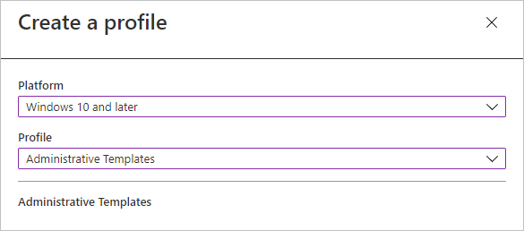
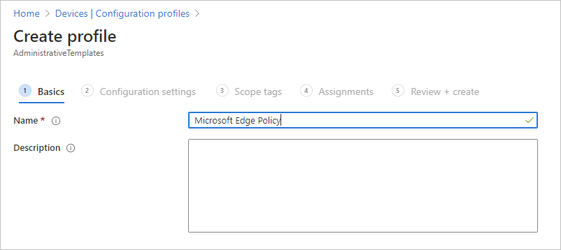
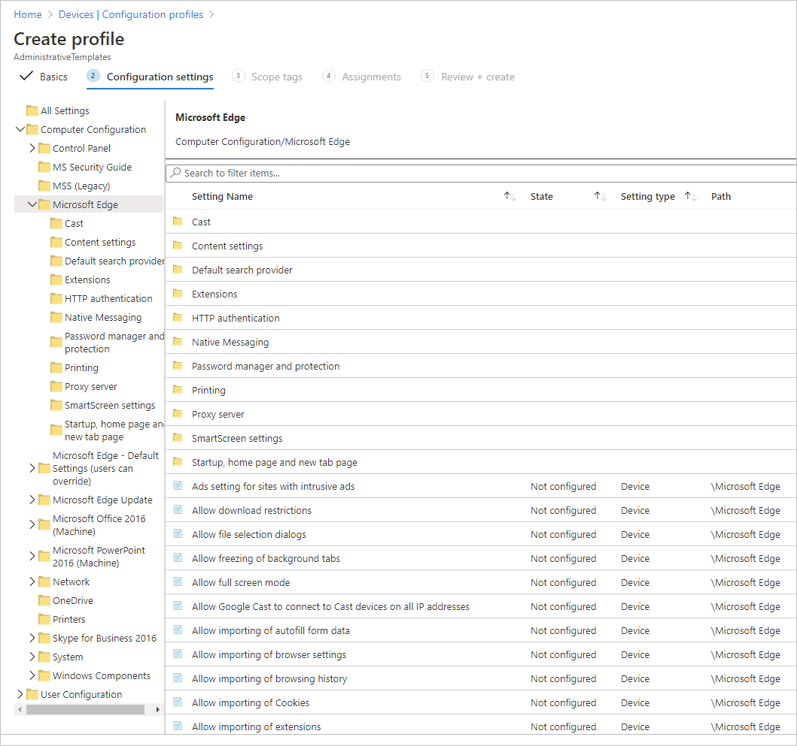
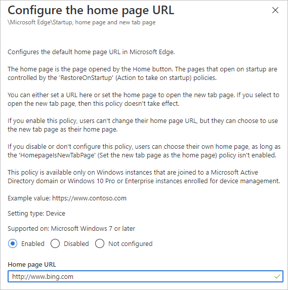
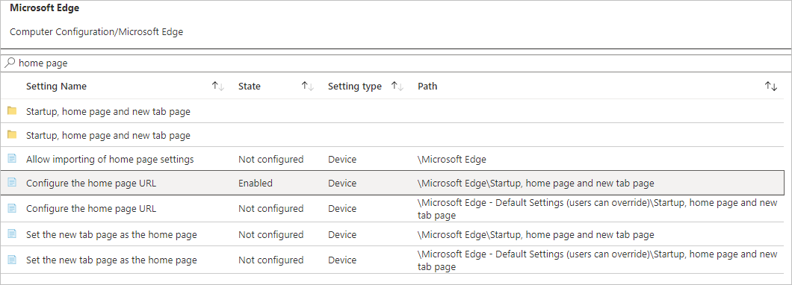
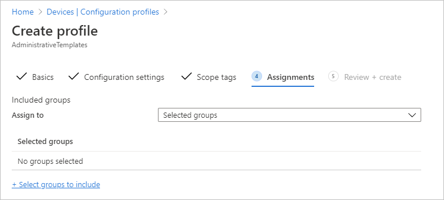

# Configure Microsoft Edge policy settings with Microsoft Intune

This article explains how to configure Microsoft Edge policy settings for Windows 10 using Microsoft Intune.

> [!NOTE]
> This article applies to Microsoft Edge version 77 or later.

You can configure Microsoft Edge policies and settings by adding a device configuration profile to Microsoft Intune. Using Intune to manage and enforce policies is equivalent to using Active Directory Group Policy or configuring local Group Policy Object (GPO) settings on user devices.

For more information about managing Microsoft Edge policies with Microsoft Intune, you can read [Manage web access by using Microsoft Edge with Microsoft Intune](https://docs.microsoft.com/intune/manage-microsoft-edge), but keep in mind that the linked article is specific to Microsoft Edge version 45 and earlier and therefore may contain information and references that don't apply to Microsoft Edge Enterprise version 77 and later.

> [!TIP]
> For information on how to configure Microsoft Edge on macOS using Microsoft Intune, see [Configure for macOS](configure-microsoft-edge-on-mac.md).

## Create a profile to manage settings in Microsoft Edge for Windows 10

Using Administrative Templates in Microsoft Intune, you can manage Microsoft Edge group policies on your Windows 10 devices using the cloud. This section will help you create a template to configure Microsoft Edge-specific application settings. When you create the template, it creates a device configuration profile. You can then assign or deploy this profile to Windows 10 devices in your organization.

### Prerequisites

- Windows 10 with the following minimum system requirements:
  - Windows 10, version 1903 with [KB4512941](https://support.microsoft.com/kb/4512941) installed
  - Windows 10, version 1809 with [KB4512534](https://support.microsoft.com/kb/4512534) installed
  - Windows 10, version 1803 with [KB4512509](https://support.microsoft.com/kb/4512509) installed
  - Windows 10, version 1709 with [KB4516071](https://support.microsoft.com/kb/4516071) installed

### Create an Administrative Templates profile

This procedure leverages Administrative templates (which you might be familiar with from Group Policy) that are built into Intune. You can use these templates to create a policy for Microsoft Edge by selecting settings from a pre-configured list.

1. Sign in to the [Microsoft Endpoint Manager](https://endpoint.microsoft.com/) portal.
2. Select **Devices** in the left-hand navigation pane.
3. From **Devices** | **Overview**, select **Configuration Profiles** (under Policy heading).
4. On the top command bar, select **Create profile**.
5. In the drop-down list below **Platform**, select **Windows 10 and later**.
6. In the drop-down list below **Profile**, select **Administrative Templates** and then click the **Create** button. The next screenshot shows the drop-down lists to select the platform and type of profile.

    

7. On the **Basics** tab, enter a descriptive **Name**, such as Microsoft Edge Policy. Optionally, enter a  **Description** for the policy.
The next screenshot shows the form for the **Basics** tab and the menu bar shows the next steps (as grayed out tabs) to create the profile.

   

8. Select **Next**.
9. On the **Configuration settings** tab, select the Microsoft Edge folder in one of the following locations:

   - below the Computer Configuration folder
   - below the User Configuration folder.

   The available settings for Microsoft Edge will be shown on the right pane. For example, *Computer Configuration/Microsoft Edge/Allow download restrictions* shown in the following screenshot.

   

   > [!NOTE]
   > See [Microsoft Edge – Policies](https://docs.microsoft.com/DeployEdge/microsoft-edge-policies) and [Microsoft Edge – Update policies](https://docs.microsoft.com/DeployEdge/microsoft-edge-update-policies) for the most complete and up to date list of all the available settings for Microsoft Edge.

10. Use the search field ("Search to filter items ...") to find a specific setting you want to configure. In this example, the search string is "home page". The next screenshot shows the search results.

    

11. After you find the setting you intend to configure, select it to expose the values you can set. In the next screenshot, we selected "Configure the home page URL" as an example.

    

12. Enable the policy and enter a value for the Home page URL, as shown in the previous screenshot.

13. Click **OK**. The settings "State" column should appear as "Enabled", as shown in the following screenshot example.

    

14. Click the **Next** button.

15. On the **Scope tags** tab, add a Scope tag if wanted, otherwise click the **Next** button.

16. On the **Assignments** tab, click **+ Select groups to include** to assign this policy to the Azure Active Directory (Azure AD) group that contains the devices or the users that you want to receive this policy setting. When you're finished, see [Assign user and device profiles in Microsoft Intune](https://docs.microsoft.com/intune/device-profile-assign) for information about how to assign the profile to your Azure AD user or device groups.

    

17. Click the **Next** button.

18. On the **Review + create** tab, review the summary of your changes to ensure it's correct and then click the **Create** button.

19. The newly created policy (Microsoft Edge Policy for Windows 10 and later) is shown in the following screenshot.

    

For more information about Windows 10 profiles, see [Use Windows 10 templates to configure group policy settings in Microsoft Intune](https://docs.microsoft.com/intune/administrative-templates-windows).

## See also

- [Microsoft Edge Enterprise landing page](https://aka.ms/EdgeEnterprise)
- [Manage web access by using Microsoft Edge with Microsoft Intune](https://docs.microsoft.com/intune/manage-microsoft-edge)
- [Use Windows 10 templates to configure group policy settings in Microsoft Intune](https://docs.microsoft.com/intune/administrative-templates-windows)
- [Deploy Microsoft Edge using Microsoft Intune](https://docs.microsoft.com/intune/apps/apps-windows-edge/?toc=https://docs.microsoft.com/DeployEdge/toc.json&bc=https://docs.microsoft.com/DeployEdge/breadcrumb/toc.json)
