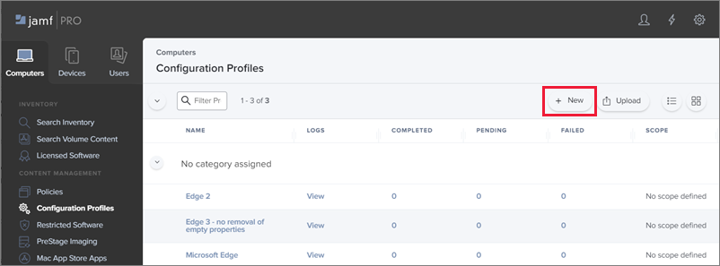

# Configure Microsoft Edge policy settings on macOS with Jamf

This article describes how to configure Microsoft Edge on macOS using a property list (.plist) file and Jamf Pro. 

For more information, see [About Information Property List Files](https://developer.apple.com/library/archive/documentation/General/Reference/InfoPlistKeyReference/Articles/AboutInformationPropertyListFiles.html) (Apple's website) and [Custom payload settings](https://support.apple.com/guide/mdm/custom-mdm9abbdbe7/1/web/1).

> [!NOTE]
> This article applies to Microsoft Edge Beta Channel version 81 or later.

## Prerequisites

The following software is required:

- Microsoft Edge Beta Channel 81
- Policy Templates file, version 81.0.416.3
- Jamf Pro, Version 10.19

## About the Jamf Pro Application & Custom Settings menu

Before Jamf Pro 10.18, managing Office 365 involved manually building a .plist file. This was a time-consuming workflow that required a strong technical background. Jamf Pro 10.18 eliminated those barriers by streamlining the configuration process. However, IT Admins could only use this new user interface for specific applications and preference domains specified by Jamf.

In Jamf Pro 10.19, a user can upload a JSON manifest as a "custom schema" to target any preference domain, and the graphical user interface will be generated from this manifest. The custom schema that's created follows the JSON Schema specification.

## Get the policy manifest for a specific version of Microsoft Edge

To get the policy manifest:

- Go to the [Microsoft Edge Enterprise landing page](https://aka.ms/EdgeEnterprise).
- On the CHANNEL/BUILD dropdown list, select **Beta 81.***.
- On the PLATFORM dropdown list, select **macOS 64 bit**.
- Click GET POLICY FILES to download our policy templates bundle.

  > [!NOTE]
  > Currently, the policy templates bundled is signed as a CAB file. You'll need to use a 3rd party tool, such as The Unarchiver, to open the file on macOS. You can get the Unarchiver from the [Microsoft Store](https://www.microsoft.com/p/the-unarchiver/9nblggh2sjjt?activetab=pivot:overviewtab) or from the [Mac App Store](https://apps.apple.com/us/app/the-unarchiver/id425424353?mt=12).

After you unpack the CAB file, navigate to the "mac" top level directory. The manifest, which is named "policy_manifest.json", is in the "mac" directory.

This manifest will be published in every policy bundle starting with build 81.0.416.3. If you want to test policies in the Dev channel, you can take the manifest associated with each Dev release and test it in Jamf Pro.  

## Use the policy manifest in Jamf Pro

Use the following steps to upload the policy manifest to Jamf Pro and then create a .plist for macOS.

1. Sign in to Jamf.
2. Select the **Computer** tab.
3. Under **Content Management**, select **Configuration Profiles**.
4. On the **Configuration Profiles** page, click **+ New**.

   

5. On **New macOS Configuration Profile**>**Options**, select **Application & Custom Settings**.
6. On the **Application & Custom Settings** form:

   - For **Creation Method**, pick **Configure settings**.
   - For **Source**, pick **Jamf Repository** from the dropdown list.
   - For **Preference Domain**, pick the name of your domain from the dropdown list.
   - For **Version**, select the version of the preference domain from the dropdown list.
   - Maybe fill out/select some more form fields.

7. do something, then do more
8. Eventually paste policy manifest into Jamf
9. Magically create a .plist!
10. Click **Save**.

After you create the .plist you still have to configure the **Scope** for the new configuration profile.

### To configure the scope

1. For **Targets**, provide the following minimum settings:

   - TARGET COMPUTERS. The options are Specific Computers or All Computers.
   - TARGET USERS. The options are Specific Users or All Users.
   - Click **Save**.
2. For **Limitations**, keep the default setting: None. Click **Cancel**.
3. For **Exclusions**, keep the default setting: None. Click **Cancel**.

## Frequently Asked Questions

### Can Microsoft Edge be configured to use master preferences?

Yes, you can configure Microsoft Edge to use a master preferences file.

A master preferences file lets you configure default settings for a browser user profile when Microsoft Edge is deployed. You can also use a master preferences file to apply settings on computers that aren't managed by a device management system. These settings are applied to the user’s profile the first time the user runs the browser. After the user runs the browser, changes to the master preferences file aren’t applied. A user can change settings from the master preferences in the browser. If you want to make a setting mandatory or change a setting after the first run of the browser, you must use a policy.

A master preferences file lets you to customize many different settings and preferences for the browser, including those shared with other Chromium based browsers and specific to Microsoft Edge.  Policy related preferences can be configured using the master preferences file. In cases where a policy is set and there’s a corresponding master preference set, the policy setting takes precedence.

> [!IMPORTANT]
> All the available preferences might not be consistent with Microsoft Edge terminology and naming conventions.  There’s no guarantee that these preferences will continue to work as expected in future releases. Preferences might be changed or ignored in later versions.

A master preferences file is a text file that’s formatted using JSON markup. This file needs to be added to the same directory as the msedge.exe executable. For system wide enterprise deployments on macOS this is typically: “*~/Library/Application Support/Microsoft/Microsoft Edge Master Preferences*" or "*/Library/Microsoft/Microsoft Edge Master Preferences*”.

## See also

- [Microsoft Edge Enterprise landing page](https://aka.ms/EdgeEnterprise)
- [Configure for macOS with Intune](configure-microsoft-edge-on-mac.md)
- [Configure for Windows](configure-microsoft-edge.md)
- [Configure for Windows with Intune](configure-edge-with-intune.md)
